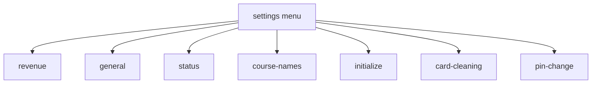

# Screen Flow

## Screen Ids

- Machine pages: `machine-1`, `machine-2`, `machine-3`, `machine-4`
- User flow: `course`, `plan`, `payment`, `complete`
- Settings flow: `settings-pin`, `settings`
- Settings sub pages: stored in `state.settingsPage`

## Main User Flow

```mermaid
flowchart TD
  M[machine-{page}] -->|click available machine| MC[MachineConfirmModal]
  MC -->|確認しました| DC[DoorConfirmModal]
  DC -->|閉じました| C{Machine type}
  C -->|wash-dry| Course[course]
  C -->|wash-only| PlanWash[plan: wash plan]
  C -->|dry-only| PlanDry[plan: dry time]
  Course -->|SELECT_COURSE| Plan[plan]
  Plan -->|SELECT_PLAN or CONFIRM_DRY_TIME| Pay[payment]
  Pay -->|INSERT_CARD| PayCard[payment: card inserted]
  PayCard -->|支払う| CompleteSuccess[complete: success]
  PayCard -->|支払わない| CompleteFailed[complete: failed]
  CompleteSuccess -->|after 2000ms| M
  CompleteFailed -->|after 2000ms| M
```

## Extension Flow

```mermaid
flowchart TD
  M[machine-{page}] -->|click busy extendable machine| MC[MachineConfirmModal]
  MC -->|確認しました| P[plan]
  P -->|dry course| DryTime[DryTimeSelectionScreen]
  P -->|wash extension| PlanCard[PlanCard]
  DryTime -->|この時間で支払う| Pay[payment]
  PlanCard -->|select extension plan| Pay
  Pay -->|支払う| CompleteAdd[complete: add/start message]
```

Rules:

- Busy machine can extend only when `canExtendMachine(machine)` returns true.
- `wash-dry` extension forces course `dry`.
- Extension sets `isExtension = true`.
- Payment status label becomes `追加`.

## Stop Machine Flow

```mermaid
flowchart TD
  M[machine-{page}] -->|long press busy machine ~2000ms| MC[MachineConfirmModal action=stop]
  MC -->|確認しました| Stop[StopConfirmModal]
  Stop -->|停止する| M
  Stop -->|戻る| M
```

Result:

- Machine status becomes `available`.
- `remainingMinutes` becomes `0`.
- Modal closes.

## Settings Entry Flow

```mermaid
flowchart TD
  M[machine-{page}] -->|long press progress step 1 ~3000ms| Gate{canEnterSettings}
  Gate -->|true| Pin[settings-pin]
  Gate -->|false| Toast[error toast on machine screen]
  Pin -->|PIN valid| Settings[settings menu]
  Pin -->|PIN invalid| M
  Settings -->|OPEN_SETTINGS_PAGE| Sub[settings sub page]
  Sub -->|戻る| Settings
  Settings -->|戻る / 中止| M
```

PIN:

- Default mock PIN: `1234`.
- PIN length: 4 digits.
- Invalid PIN resets to machine screen and shows error.

## Settings Sub Page Flow



TODO:

- Xác nhận menu cuối cùng có `カード清掃` và `暗証番号変更` tách riêng hay dùng wording cũ `カード清掃暗証番号`.

## Back And Cancel Rules

Back:

- Nếu modal đang mở: đóng modal.
- Từ `course`: về page máy của `selectedMachine`.
- Từ `plan`:
    - Nếu máy `wash-dry` và không extension: về `course`.
    - Nếu máy không cần course select: về page máy của `selectedMachine`.
- Từ `payment`: về `plan`.
- Từ `settings` sub page: về settings menu.
- Từ `settings-pin` hoặc settings menu: reset về `machine-1`.

Cancel:

- Từ `course`, `plan`, `payment`: reset về `machine-1`.
- Từ `settings-pin` hoặc `settings`: reset về `machine-1`.
- Từ machine screen: không thay đổi.
- Từ `complete`: không thay đổi.

Complete auto return:

- Khi `screen === "complete"`, app dispatch `COMPLETE_RETURN` sau `2000ms`.

## Progress Step Mapping

- Machine screens: step `1`.
- `course`, `plan`: step `2`.
- `payment`: step `3`.
- `complete`: step `4`.
- Settings screens hide progress.

## Reducer Flow Source

Source of truth hiện tại:

- `src/state/appReducer.js`
- `src/App.jsx`

Khi thêm/sửa screen id hoặc action, bắt buộc cập nhật:

- `docs/SCREEN_SPEC.md`
- `docs/SCREEN_FLOW.md`
- Component liên quan trong `docs/COMPONENT_SPEC.md`
